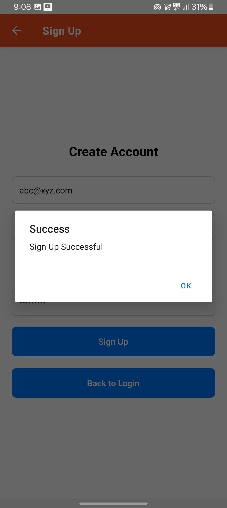

# React Native Authentication App

A mobile authentication application built with React Native and TypeScript, featuring signup/login forms with validation.

## App Screenshots & Demo

### Login Screen

<div style="display: flex; justify-content: center; align-items: center; gap: 10px;">
  
  
</div>

- Clean login interface
- Email and password validation
- Remember Me checkbox
- Error messages display

### Sign Up Screen

<div style="display: flex; justify-content: center; align-items: center; gap: 10px;">
  
  
</div>

- Password strength indicator
- Real-time validation
- Matching password verification

### App Flow Demo

<div style="display: flex; justify-content: center; align-items: center; gap: 10px;">
  
</div>

- Complete authentication flow
- Form validation in action
- Screen transitions
- Error handling demonstration

## Setup & Installation

1. Prerequisites:

    ```bash
    node >= 14.0.0
    npm >= 6.0.0
    expo-cli
    ```
    - ExpoGo App

2. Install dependencies:

    ```bash
    npm install
    ```

3. Start the app:

    ```bash
    # Start the App
    npm start
    ```

4. View the utput on ExpoGo app

## Design Choices

### Architecture

- TypeScript for type safety and better development experience
- Formik for form management
- Yup for validation schemas
- React Navigation for routing
- Async Storage for persistent data

### UI/UX

- Clean, minimalist interface
- Form validation with immediate feedback
- Password strength indicator
- Remember Me functionality
- Accessibility support with ARIA labels

### Security

- Password validation rules
- Secure text entry for passwords
- Email format validation

## Limitations & Assumptions

### Limitations

- Basic authentication flow (no backend integration)
- Local storage only for Remember Me feature
- Limited offline functionality
- No biometric authentication

### Assumptions

- Users have basic understanding of authentication flows
- English language interface
- Internet connectivity for future backend integration

## Future Improvements

- Backend integration
- Social auth
- Biometric authentication
- Multi-language support
- Enhanced security measures
